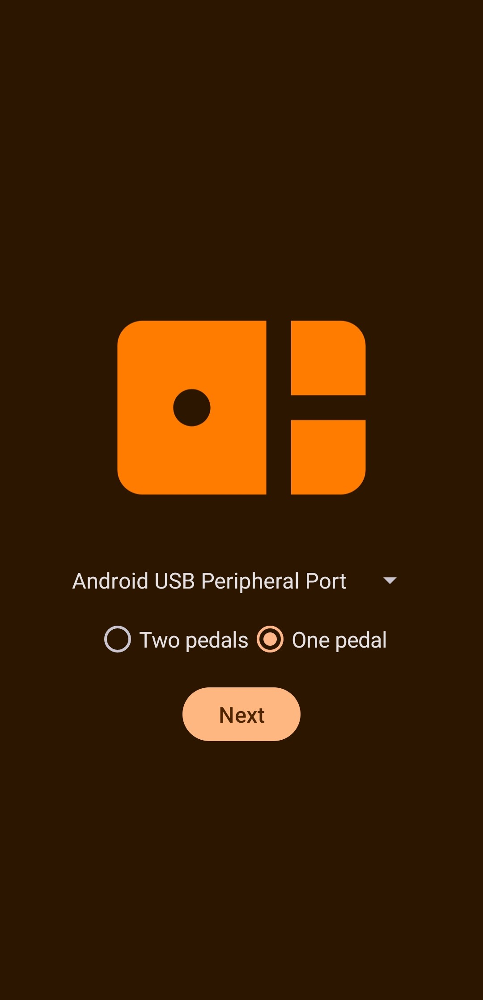
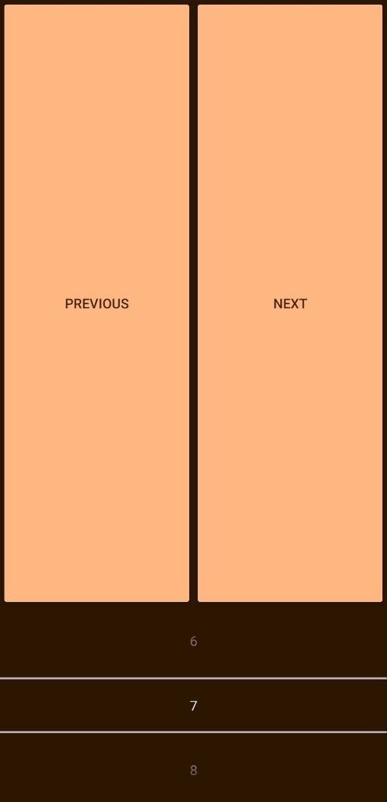

# SwitcherMIDI 
**Virtual MIDI programs switcher for Android**

## Description

This is my first personal project for Android which is developed right after completion of several Android Essential trainings.

The application has been created to cover personal needs. I play electric guitar with audio card on my PC to apply a set of digital effects. And I went to the point when I needed switch between different presets. To solve this problem I found different devices to buy but discovered that it can be implementing for android device, so I did this.

Tested with AmpliTube 5.

## Screenshots

<!--  -->

